# Food Delivery Website

This is a full-stack Food Delivery Website built using the MERN stack (MongoDB, Express.js, React.js, Node.js) with Stripe integration for secure online payments. It supports a complete food ordering experience — from menu browsing and cart management to admin controls and real-time order tracking.

---

## 🛠 Technologies Used

- React.js  
- Node.js  
- Express.js  
- MongoDB  
- Stripe API  
- HTML & CSS  
- JavaScript  

---

## ✨ Features

- User Registration and Login  
- Browse Food Items by Category  
- Add to Cart and Checkout  
- Stripe Integration for Secure Payments  
- Real-Time Order Updates  
- Admin Panel to Manage Orders and Menu  

---

## 📁 Folder Structure

- /frontend – Customer-facing UI  
- /backend – Node.js & Express server logic  
- /admin – Admin interface to manage orders and products  
- /backend/src – Contains payment logic, DB connection, and routes  

---

## 🚀 How to Run This Project Locally

### 1. Install Prerequisites

- 🔗 [Download Node.js](https://nodejs.org)  
- 🔗 [Install MongoDB](https://www.mongodb.com/try/download/community) or [Create a MongoDB Atlas Account](https://www.mongodb.com/cloud/atlas)

---

### 2. Clone the Repository

bash
git clone https://github.com/Anchalbisht10/food-delivery-website
cd food-delivery-website

---

### 3. Install Dependencies

Install separately for each folder:

For frontend:  
bash
cd frontend
npm install

For backend:  
bash
cd ../backend
npm install

For admin panel:  
bash
cd ../admin
npm install

---

### 4. Set Up Environment Variables

You need to create a .env file inside the /backend/src/ folder with your credentials and Stripe key:

📁 /backend/src/.env

env
MONGODB_URI=your_mongodb_connection_string_here
STRIPE_SECRET_KEY=your_stripe_secret_key_here
JWT_SECRET=your_custom_jwt_key
PORT=5000

> ⚠ Important Notes:
> - Your .env file is required to connect the backend to MongoDB and Stripe.
> - This file is intentionally not included in the GitHub repo for security.
> - Users must generate their own Stripe key from [https://stripe.com](https://stripe.com)
> - Users must also use their own MongoDB Atlas URI or local MongoDB connection string.

---

### 5. Run the Application

Start the backend:
bash
cd backend
npm start

Start the frontend:
bash
cd ../frontend
npm start

Start the admin panel:
bash
cd ../admin
npm start

---

### 6. Access the App in Browser

- Frontend → 🔗 [http://localhost:3000](http://localhost:3000)  
- Admin Panel → 🔗 [http://localhost:3001](http://localhost:3001) (or whichever port it’s configured to)  

## Live Project Deployment

The backend and frontend of this project are already deployed and can be accessed directly:

- **Backend Repository & Live API**: [Backend GitHub Repository](https://github.com/Anchalbisht10/fooddel-backend) | [Live API Link](https://fooddel-backend-5yfj.onrender.com/)
- **Frontend Repository & Live Site**: [Frontend GitHub Repository](https://github.com/Anchalbisht10/fooddel-frontend) | [Live Frontend Link](https://fooddel-frontend-pi.vercel.app/)

> You can explore this project live without setting up locally by visiting the above links.

---
# Screenshots of Projects

## Frontend

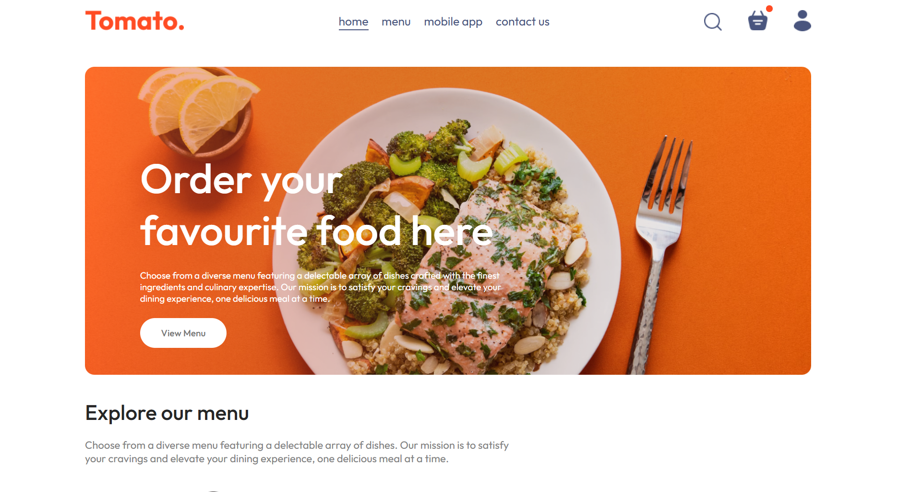  
This is the landing page of the food delivery application, giving users an overview of the platform and easy access to navigation.

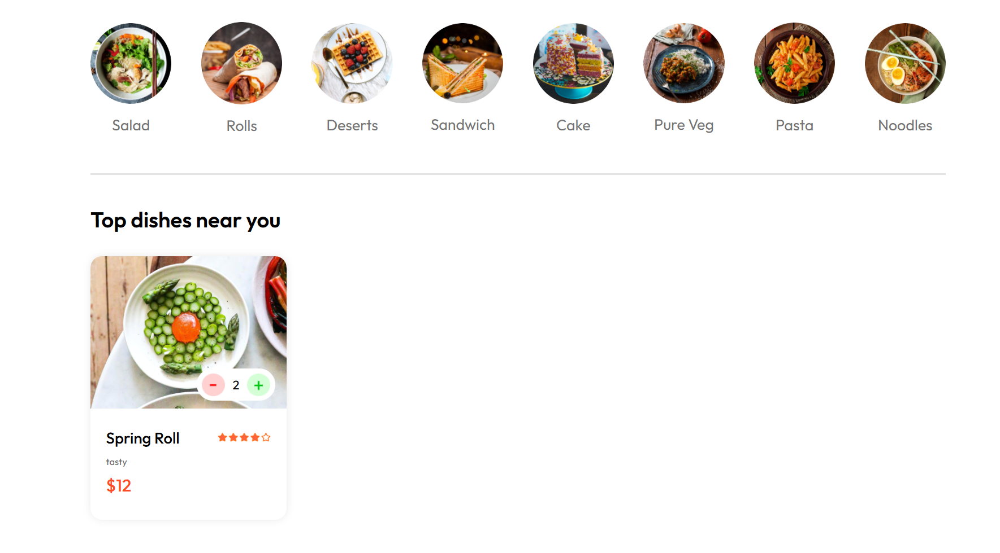  
Displays the complete menu with food items, details, and prices for users to browse and select.

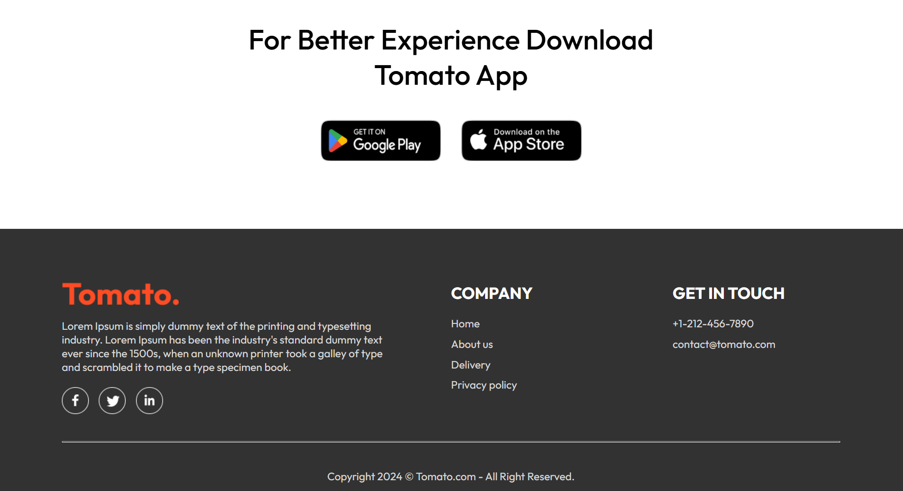  
Shows the contact section where users can reach out for support, inquiries, or feedback.

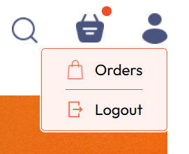  
User dashboard screen that lists orders and provides the option to securely log out.

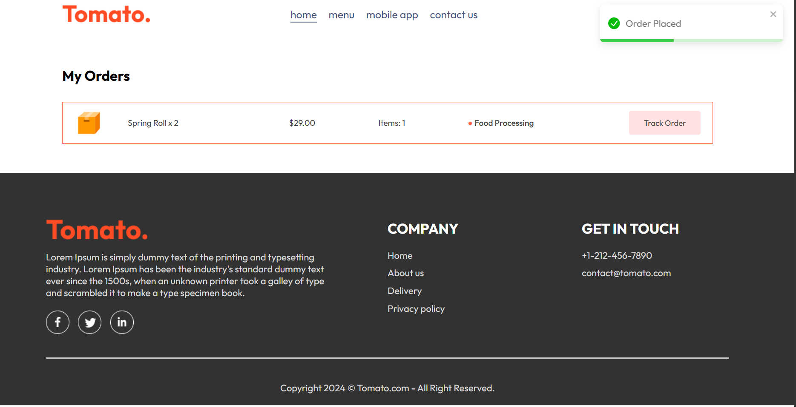  
Detailed view of all orders placed by the user, including status and item details.

  
Cart overview with a signup button for new users to create an account before checkout.

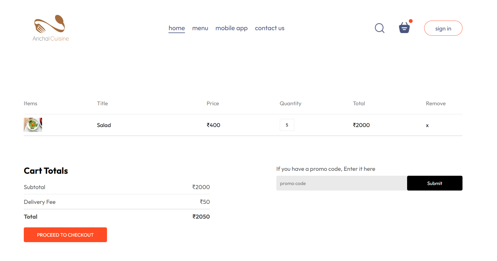  
Shows items added to the cart, ready for review before proceeding to delivery.

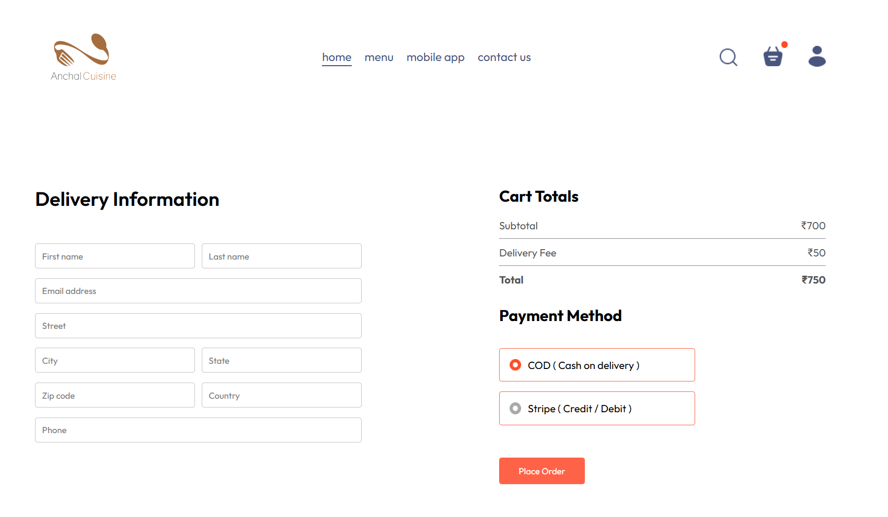  
Form where users enter delivery address and choose payment method (Cash on Delivery or online).

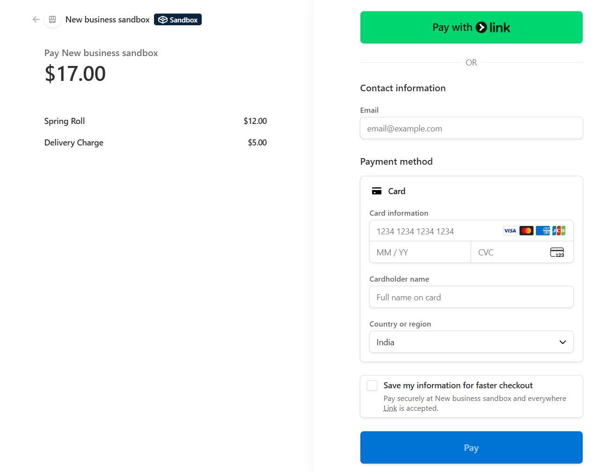  
Final step of the checkout process where users confirm and complete payment.

## Admin Panel

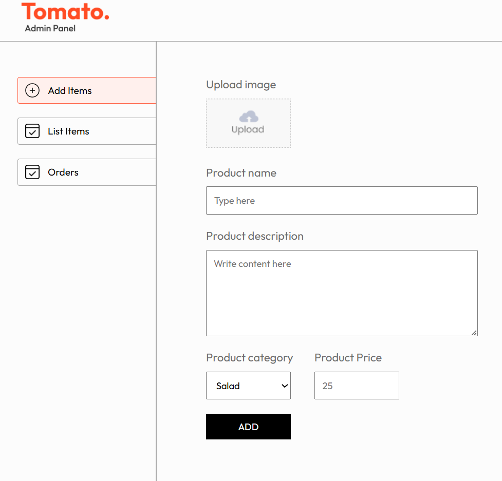  
Admin dashboard screen for adding new food items into the system.

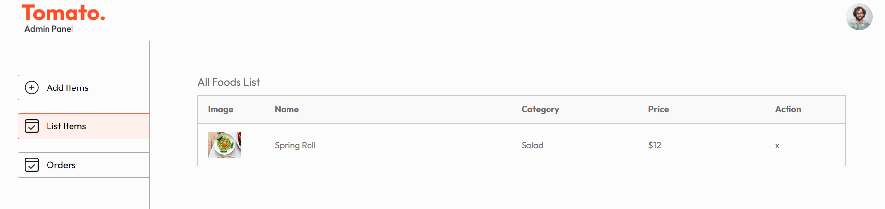  
Displays all food items added by the admin, with details for easy management.

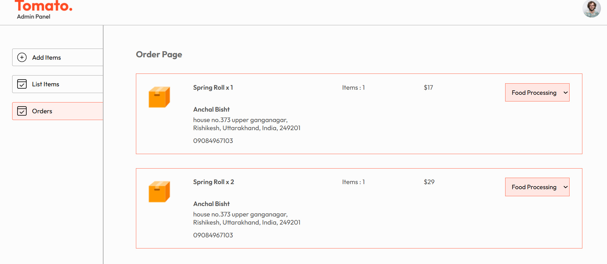  
Admin view of customer orders, allowing tracking and management of the delivery process.

## 🙋 About the Developer

*Anchal Bisht*  
📧 [anchal001bisht@gmail.com](mailto:anchal001bisht@gmail.com)  
💻 [GitHub: Anchalbisht10](https://github.com/Anchalbisht10)

---
